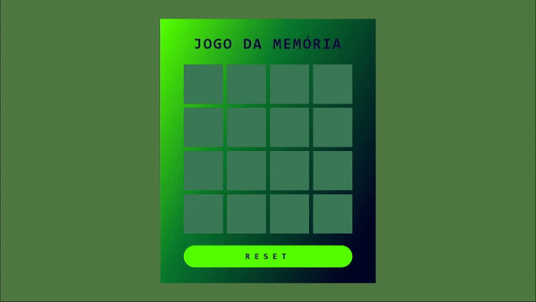

## Jogo da memória

### Tecnologias Utilizadas

- HTML5 e CSS3 para a estrutura e aparência do jogo.
- JavaScript para a lógica de programação e interatividade.

### Funcionalidades 

- **Encontre os Pares**: Diversas cartas estão espalhadas aleatóriamente, o jogador clica em duas e caso sejam iguais permanecem viradas. Ache todos com sua memória e ganhe!

### Como Jogar

1. Clone este repositório para sua máquina local.
2. Abra o arquivo `index.html` em seu navegador web.
3. Com o mouse clique sobre as cartas.

### Contribuição

Contribuições são bem-vindas! Se você deseja melhorar este jogo, adicionar novos recursos ou corrigir problemas, sinta-se à vontade para abrir um _pull request_.

### Créditos

Este jogo foi desenvolvido como parte de um projeto educacional da Digital Innovation One.

---

Lembre-se de conferir o repositório original [aqui]([https://github.com/digitalinnovationone/jsgame-detona-ralph](https://github.com/digitalinnovationone/js-emoji-memory-game)https://github.com/digitalinnovationone/js-emoji-memory-game) e deixar uma ⭐️ se você gostou do projeto!
